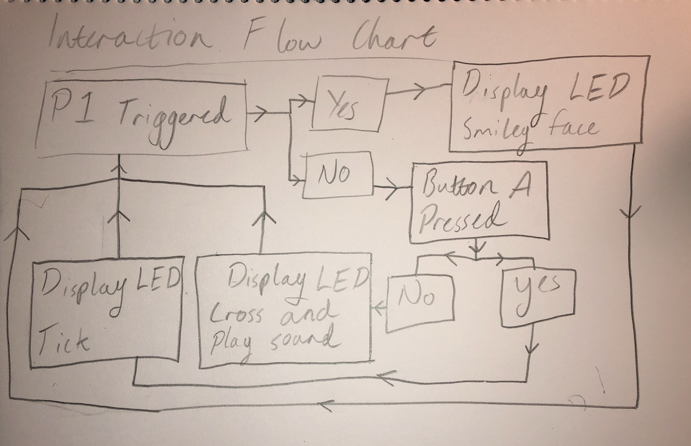

# 1701QCA Making Interaction - Assessment 2 workbook

You will use this workbook to keep track of your progress through the course and also as a process journal to document the making of your projects. The comments in italics throughout the template give suggestions about what to include. Feel free to delete those instructions when you have completed the sections.

When you have completed the template, submit the link to the GitHub Pages site for this repository as a link in Learning@Griffith. The link should be something like [https://qcainteractivemedia.github.io/1701QCA-Assessment2/](https://qcainteractivemedia.github.io/1701QCA-Assessment2/) where `qcainteractivemedia` is replaced with your GitHub username and `1701QCA-Assessment2` is replaced with whatever you called the repository this template is contained in when you set it up.

## Project working title ##
*Insert a name for the project as you conceive of it at the moment.*

## Related projects ##
*Find about 6 related projects to the project you choose. A project might be related through  function, technology, materials, fabrication, concept, or code. Don't forget to place an image of the related project in the appropriate folder and insert the filename in the appropriate places below. Copy the markdown block of code below for each project you are showing.*

### Related project 1 ###
FurReal Pets

https://www.youtube.com/watch?v=oUpXGdyU1oc&list=PLNXV9Mb7egjGjtA6KOjx86IwIpHQZ-ow5&index=2

This project is related to mine because it is an entertaining toy that is interacted with through basic buttons with set responses. 

### Related project 2 ###
Parental Approval

https://www.youtube.com/watch?v=M1B3gATS0GE

This project is related to mine because it is made at home and is a simple idea. It is a device made purely for entertainment and uses simple mechanices.

### Related project 3 ###
Microbit Combination Lock Box

https://make.techwillsaveus.com/microbit/activities/combination-lock

This project is related to mine because I am also making a box that has an opening mechanism. The code and device use is related to mine.

### Related project 4 ###
Tamagotchi

https://www.youtube.com/watch?v=G-dnRcAekBU

This project is related to mine because it is an entertaining toy that is interacted with through basic buttons with set responses.  

## Other research ##

Why You should Make Useless Things tedtalk:
https://www.youtube.com/watch?v=c0bsKc4tiuY
I liked the points made in this tedtalk and I felt that they reflected the lessons learnt so far in class this term.

I found the code from the padlock projects really helpful in coding my puzzle box
https://make.techwillsaveus.com/microbit/activities/combination-lock

## Conceptual progress ##

### Design intent ###
To create a small device/game that is simple and entertaining.

### Design concept 1 ###

My first idea was an electronic pet. lots of people have been wanting pets in the last few weeks since we have been stuck inside. I think that an electronic household pet could be helpful for people who can't get a pet right now. I would want the pet to have a few simple commands that had randomised outcomes. My idea is to create a toy where the microbit LEDs are the interface.

### Design concept 2 ###
My second idea was an alarmed cookie jar to stop people stealing your snacks.  

### Final design concept ###
*This more fully developed concept should include consideration of the interaction scheme, technical functionality, fabrication approach, materials to be used, and aesthetic.*

### Interaction flowchart ###

## Physical experimentation documentation ##

*In this section, show your progress including whichever of the following are appropriate for your project at this point.
a.	Technical development. Could be code screenshots, pictures of electronics and hardware testing, video of tests. 
b.	Fabrication. Physical models, rough prototypes, sketches, diagrams of form, material considerations, mood boards, etc.
Ensure you include comments about the choices you've made along the way.*

*You will probably have a range of images and screenshots. Any test videos should be uploaded to YouTube or other publicly accessible site and a link provided here.*

This is the first code that I developed and tested. It's a simple circus that when closed shows a smiley face and when open shows a cross and makes an alerting noise

I then placed all of the wires within the box to make it look cleaner. 

I added to the code a function to deactivate the alarm while the A button is pressed.

## Design process discussion ##
*Discuss your process in getting to this point, particularly with reference to aspects of the Double Diamond design methodology or other relevant design process.*

## Next steps ##
*Write a list or provide other information about your plan to move the project forward to be ready to present by video and documentation in week 12 of the course.*
